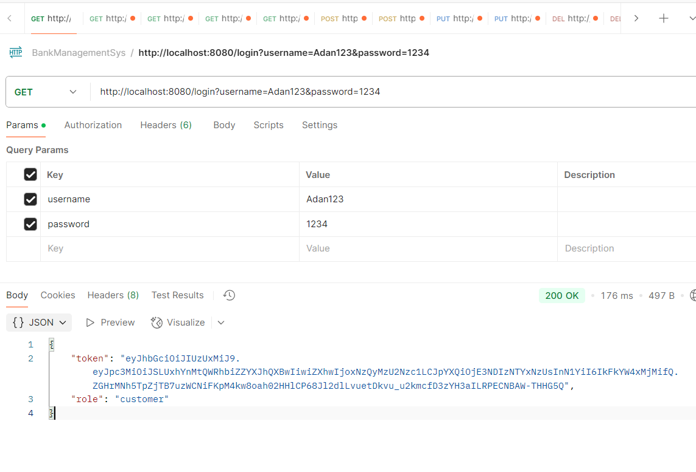
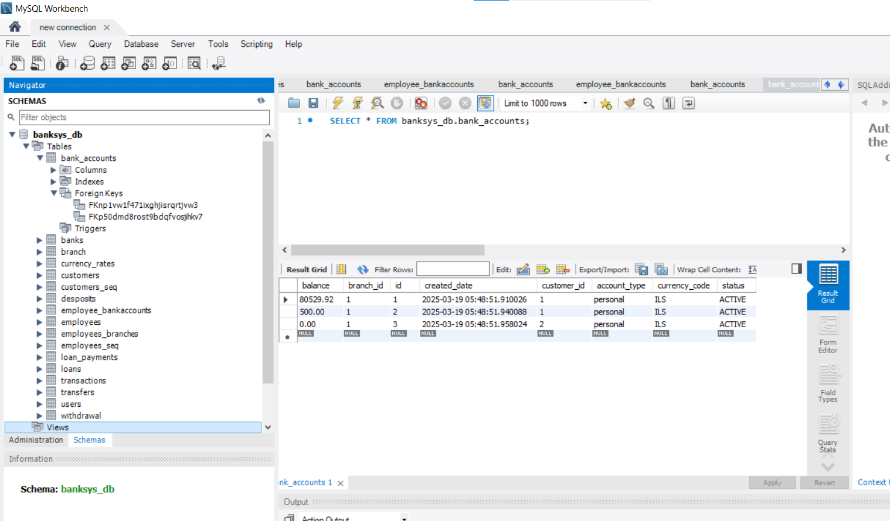
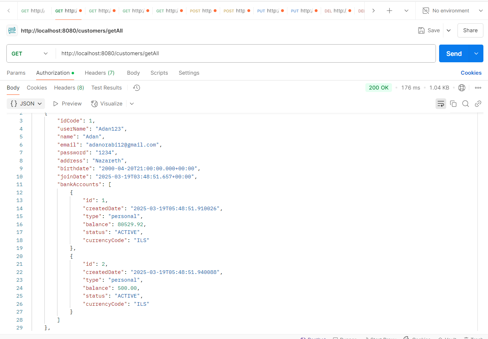

# 🏦 Bank Management System

## 📌 Project Overview
The **Bank Management System** is a backend system designed to manage bank operations, including **customer accounts, transactions, loans, employee management, and foreign currency operations**. The system provides **REST API services** for remote access via client applications.

It includes **role-based authentication**, **background automation for banking operations**, **secure transactions**, and **API endpoints** that integrate seamlessly with frontend applications.

---

## 🚀 Features & Functionalities

### **🧑‍💼 Customer & Account Management**
- **Customer Management:**
  - Add, update, and delete customer details.
  - Register new customers with **email verification (OTP)**.
  - Employees can manage customer accounts.
- **Bank Account Management:**
  - Create and manage accounts.
  - Restrict, suspend, or delete accounts.
  - Connect bank accounts to branches and customers.

### **🏦 Employee & Branch Management**
- **Employees can:**
  - Manage customer accounts, approve loans, and oversee transactions.
  - Be assigned to multiple branches and manage specific accounts.
- **Branch Management:**
  - Add, update, and delete bank branches.
  - Assign employees and bank accounts to branches.

### **💰 Transactions & Banking Operations**
- **Deposit & Withdraw:** Customers can deposit and withdraw funds.
- **Check Account Balance:** Retrieve real-time account balance.
- **Fund Transfers:**
  - Customers can transfer funds **within the same bank**.
  - Transfers are subject to bank policies.
- **Employees can:**
  - Approve, suspend, or restrict transactions if necessary.

### **🌍 Foreign Currency Transactions**
- **Currency Conversion:** Fetch exchange rates from an external foreign currency service.
- **Deposit & Withdraw Foreign Currency:** Customers can transact in multiple currencies.

### **🏦 Loan System**
- Customers can apply for **multiple loans**.
- Employees can approve, manage, or decline loan applications.
- **Loan Repayment:** Monthly installment deductions from accounts.

### **⏳ Background Automation**
- **Daily Exchange Rate Update** (fetches the latest foreign currency rates).
- **Monthly Loan Repayment Deductions** (automated from customer accounts).
- **Overdraft Notifications** (sends daily emails to customers in overdraft).

### **🔒 Authentication & Security**
- **JWT-Based Secure Login** for customers and employees.
- **Role-Based Access:** Customers & Admins (Bank Employees).
- **OTP Verification for Email Confirmation**.

---

## 🛠️ Tech Stack
- **Backend:** Java Spring Boot 🚀
- **Database:** MySQL (Spring Data JPA) 🗄️
- **Security:** Spring Security (JWT + OTP) 🔒
- **Task Scheduling:** Spring Boot Scheduler ⏰
- **Foreign Currency API:** External service for exchange rates 🌍
- **Tools:** Lombok, Maven, Swagger UI 📄

---

## 📂 Project Structure
```
├── src
│   ├── main
│   │   ├── java/com/example/BankManagementSys
│   │   │   ├── Advices  (Global Exception Handling)
│   │   │   ├── Components (Login Data & Utility Classes)
│   │   │   ├── Config (App Configuration)
│   │   │   ├── Controllers (API Controllers)
│   │   │   ├── Entities (Database Models)
│   │   │   ├── Enums (Bank Account & Transaction Statuses)
│   │   │   ├── Exceptions (Custom Exception Classes)
│   │   │   ├── Repositories (Database Access Layer)
│   │   │   ├── Schedulers (Automated Banking Processes)
│   │   │   ├── Security (JWT, OTP, Role-Based Access)
│   │   │   ├── Services (Business Logic Layer)
│   │   │   ├── Utils (Helper Functions)
│   │   ├── resources
│   │   │   ├── application.properties (Config Settings)
├── pom.xml
├── README.md
```

---

## ⚙️ Installation & Setup

1️⃣ **Clone the repository:**
```sh
git clone https://github.com/yara145/BankManagementSystem.git
cd BankManagementSystem
```

2️⃣ **Configure Database & Properties:**
- **Edit `application.properties`**:
```properties
spring.datasource.url=jdbc:mysql://localhost:3306/bank_management_db
spring.datasource.username=root
spring.datasource.password=yourpassword
spring.jpa.hibernate.ddl-auto=create
application.security.jwt.security-key=your-secret-key
```

3️⃣ **Run the Application:**
```sh
mvn spring-boot:run
```

---

## 📡 API Endpoints

### **🧑‍💼 Customer & Account APIs**
- **Register & Verify Email (OTP):** `/api/customers/register`
- **Login (JWT Authentication):** `/api/auth/login`
- **Manage Customers:** `/api/customers`
- **Account Operations:** `/api/accounts`
- **Restrict/Suspend Account:** `/api/accounts/restrict/{id}`

### **🏦 Employee & Branch APIs**
- **Manage Employees:** `/api/employees`
- **Assign Employees to Bank Accounts:** `/api/employees/connect/{employeeId}/bankAccount/{bankAccountId}`
- **Manage Bank Branches:** `/api/branches`

### **💰 Transactions APIs**
- **Deposit Funds:** `/api/deposits`
- **Withdraw Funds:** `/api/withdrawals`
- **Check Balance:** `/api/accounts/balance/{id}`
- **Transfer Funds:** `/api/transfers`

### **🌍 Foreign Currency APIs**
- **Get Exchange Rates:** `/api/currency-rates`
- **Deposit in Foreign Currency:** `/api/forex/deposit`
- **Withdraw in Foreign Currency:** `/api/forex/withdraw`

### **🏛️ Loan APIs**
- **Apply for a Loan:** `/api/loans/apply`
- **View Loan Details:** `/api/loans/{customerId}`
- **Loan Repayment:** `/api/loans/repay/{loanId}`

### **⏳ Automated Banking Processes**
- **Daily Exchange Rate Update:** `/api/schedulers/exchange-rates`
- **Monthly Loan Deduction:** `/api/schedulers/loan-payments`
- **Overdraft Email Notifications:** `/api/schedulers/overdrafts`

---

## 🔥 Exception Handling
The system includes **global exception handling** to provide meaningful API responses.
Example from `ControllersExceptionHandler.java`:
```java
@ExceptionHandler(BankAccountNotFoundException.class)
@ResponseStatus(HttpStatus.NOT_FOUND)
public ResponseEntity<String> handleBankAccountNotFound(BankAccountNotFoundException e) {
    return ResponseEntity.status(HttpStatus.NOT_FOUND).body("Bank account not found.");
}
```

---

## 📜 License
This project is open-source and available under the **MIT License**.

---
## 📸 Screenshots Overview

### 🛡️ Authentication Example
After logging in, the system returns a **JWT token** for authentication.

#### **Login Request in Postman**


### 🗄️ Database Overview
The **Bank Management System** uses a **MySQL database** to store customer accounts, transactions, loans, and employee data.  
Below is an example of the **bank_accounts table** displaying sample records.

#### 📸 Bank Accounts Table (MySQL Workbench View)


#### **Key Columns in `bank_accounts` Table**
- `id`: Unique identifier for each bank account.
- `balance`: Current account balance.
- `branch_id`: The branch where the account is registered.
- `customer_id`: The account owner.
- `account_type`: Defines whether the account is **personal** or **business**.
- `currency_code`: Stores the currency type (e.g., **ILS, USD**).
- `status`: Represents the current account status (**ACTIVE, RESTRICTED, SUSPENDED**).

### 📡 API Example: Fetching Customers with Their Accounts
The system provides a **REST API** to retrieve customer details along with their linked bank accounts.

#### 📸 Get All Customers API (`/customers/getAll`)
The following image demonstrates a **GET request** to fetch all customers along with their associated bank accounts.



---

🚀 **Contributions & Feedback** are welcome! If you like this project, don't forget to ⭐ it on GitHub!
